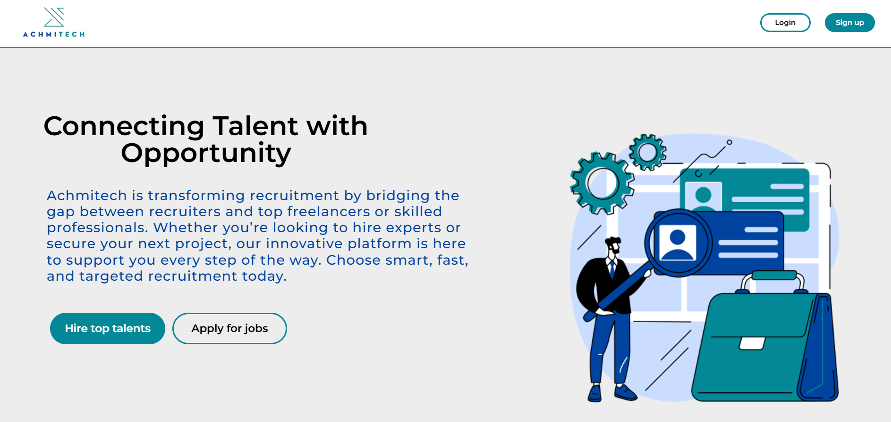
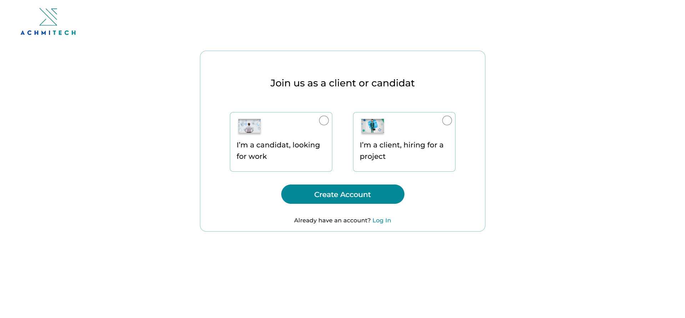
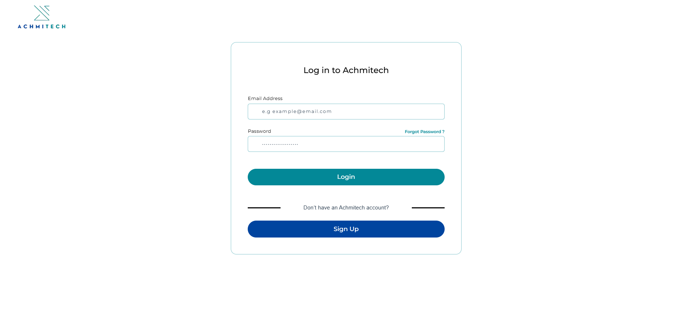
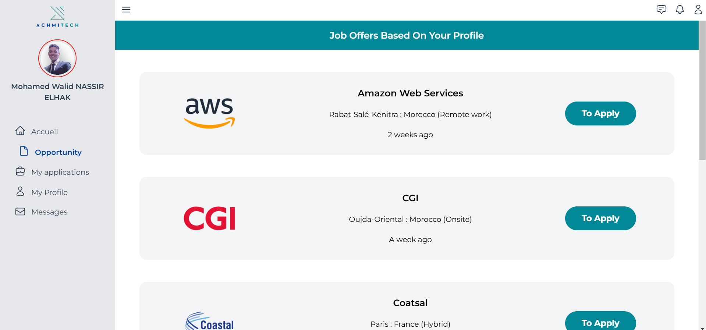
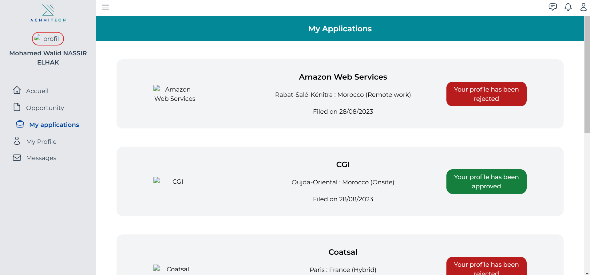
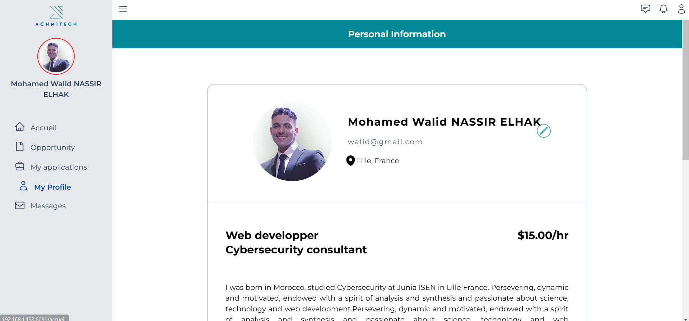

# Recruitment Platform - Achmitech

Achmitech Recruitment Platform is the source code of a sophisticated recruitment application developed for **Adelphatech** during my internship there. It serves as a bridge between recruiters and candidates, particularly freelancers, aiming to streamline the recruitment process through an intuitive user interface and powerful functionalities. This repository contains the frontend code, which is built using **Vue.js**.

## Table of Contents
- [Features](#features)
- [Installation Instructions](#installation-instructions)
  - [Clone the Repository](#clone-the-repository)
  - [Install Dependencies](#install-dependencies)
  - [Run the Development Server](#run-the-development-server)
- [Project Structure](#project-structure)
- [Technologies Used](#technologies-used)
- [Contact](#contact)

## Features
RecruitmentPlatform offers a wide array of features designed to facilitate the recruitment process for both clients and candidates. Key features include:

1. **Home Page and User Interface (UI) for Authentication**:
   - A welcoming and intuitive home page.
   - Seamless authentication process for new and returning users, including sign-up and login functionalities.

<br><p align="center">
  
  
  
  
</p>


2. **Client and Candidate Sections**:
   - Separate interfaces tailored to the needs of **clients** and **candidates**.

   - **Clients**:
     - Post job opportunities.
     - Review candidate applications.
     - Manage profiles.
     - Communicate with potential hires.

   - **Candidates**:
     - Browse job listings.
     - Submit applications.
     - Manage their profiles.
     - Message recruiters directly.


<br><p align="center">
  
  
  
</p>

3. **Profile Management**:
   - Both clients and candidates can create and maintain detailed profiles, which can include portfolio items, company information, and personal achievements.

<br><p align="center">
  
  
</p>

4. **Messaging Functionalities**:
   - An integrated messaging system to streamline communication between recruiters and candidates, enabling direct messaging to discuss opportunities and next steps.

<br><p align="center">
  
  
</p>

## Installation Instructions
To set up the project locally, follow these steps:

### Clone the Repository
First, clone the repository to your local machine using the following command:

```bash
git clone https://github.com/Walidnsr/Achmitech-Recruitment-Platform.git
cd RecruitmentPlatform
```

### Install Dependencies
Once inside the project directory, install the necessary dependencies:

```bash
npm install
```

### Run the Development Server
To start the development server and view the application in your browser:

```bash
npm run serve
```

The application should now be running locally on `http://localhost:8080` by default.

## Project Structure
The project is organized as follows:

```
Achmitech-Recruitment-Platform
├─ .browserslistrc
├─ .gitignore
├─ babel.config.js
├─ jsconfig.json
├─ package-lock.json
├─ package.json
├─ postcss.config.js
├─ public
│  ├─ favicon.ico
│  └─ index.html
├─ README.md
├─ src
│  ├─ App.vue
│  ├─ assets
│  │  ├─ comments
│  │  │  ├─ ferme.png
│  │  │  ├─ Img1.png
│  │  │  ├─ Img2.jpg
│  │  │  ├─ Img3.jpeg
│  │  │  ├─ Img4.jpg
│  │  │  └─ ouvert.png
│  │  ├─ entreprises
│  │  │  ├─ aws.png
│  │  │  ├─ cgi.png
│  │  │  ├─ coatsal.png
│  │  │  ├─ dxc.png
│  │  │  ├─ ibm.png
│  │  │  └─ oracle.png
│  │  ├─ Eye.png
│  │  ├─ great
│  │  │  ├─ Ima1.png
│  │  │  ├─ Ima2.png
│  │  │  ├─ Ima3.png
│  │  │  └─ Ima4.png
│  │  ├─ Intro.png
│  │  ├─ left.png
│  │  ├─ Logo.png
│  │  ├─ Logo1.png
│  │  ├─ Popular
│  │  │  ├─ Img1.png
│  │  │  ├─ Img2.png
│  │  │  ├─ Img3.png
│  │  │  ├─ Img4.jpg
│  │  │  ├─ Img5.jpg
│  │  │  └─ Img6.jpg
│  │  ├─ right.png
│  │  ├─ SignUp
│  │  │  ├─ Img1.png
│  │  │  └─ Img2.png
│  │  ├─ Something
│  │  │  ├─ Img1.png
│  │  │  ├─ Img2.png
│  │  │  ├─ Img3.png
│  │  │  └─ Img4.png
│  │  └─ styles.css
│  ├─ components
│  │  ├─ componentsCandidat
│  │  │  ├─ accueilCandidat.vue
│  │  │  ├─ appCandidat.vue
│  │  │  ├─ appsCandidat.vue
│  │  │  ├─ menuNavBar.vue
│  │  │  │  ├─ messageMenu.vue
│  │  │  │  ├─ notifsMenu.vue
│  │  │  │  └─ profileMenu.vue
│  │  │  ├─ messagesCandidat.vue
│  │  │  ├─ msgBody.vue
│  │  │  ├─ msgCandidat.vue
│  │  │  ├─ navBar.vue
│  │  │  ├─ opportunitiesCandidat.vue
│  │  │  ├─ opportunityCandidat.vue
│  │  │  ├─ profileCandidat.vue
│  │  │  └─ sideBar.vue
│  │  ├─ componentsHome
│  │  │  ├─ ChiffresHome.vue
│  │  │  ├─ CommentsHome.vue
│  │  │  ├─ IntroHome.vue
│  │  │  ├─ NavBar.vue
│  │  │  ├─ NeedSomething.vue
│  │  │  ├─ OneComment.vue
│  │  │  ├─ OneGreat.vue
│  │  │  ├─ OneNeed.vue
│  │  │  ├─ OnePopular.vue
│  │  │  ├─ PopularHome.vue
│  │  │  └─ WhatGreat.vue
│  │  ├─ componentsSignUp
│  │  │  ├─ SignCandidat.vue
│  │  │  └─ SignClient.vue
│  │  └─ FooterView.vue
│  ├─ data
│  │  └─ data.js
│  ├─ main.js
│  ├─ pages
│  │  ├─ candidat
│  │  │  └─ HomeCandidat.vue
│  │  └─ layout
│  │     ├─ EntrepriseVue.vue
│  │     ├─ HomeView.vue
│  │     ├─ HowItWorksVue.vue
│  │     ├─ LoginView.vue
│  │     └─ SignUpView.vue
│  └─ router
│     └─ index.js
├─ tailwind.config.js
└─ vue.config.js
```

### Notable Directories and Files
- **`src/components`**: Contains reusable components for the **candidates**, **home page**, and **sign-up process**.
- **`src/assets`**: Includes static resources such as images and stylesheets.
- **`src/pages`**: Contains different page views, including candidate and layout pages.
- **`public/index.html`**: The entry point of the application.

## Technologies Used
- **Vue.js**: The core front-end framework used for building a reactive and modular user interface.
- **Tailwind CSS**: Utility-first CSS framework used for styling the application and ensuring a modern design.
- **JavaScript (ES6+)**: Used throughout the application for logic implementation.
- **Babel**: For JavaScript compilation, ensuring compatibility across different browsers.


